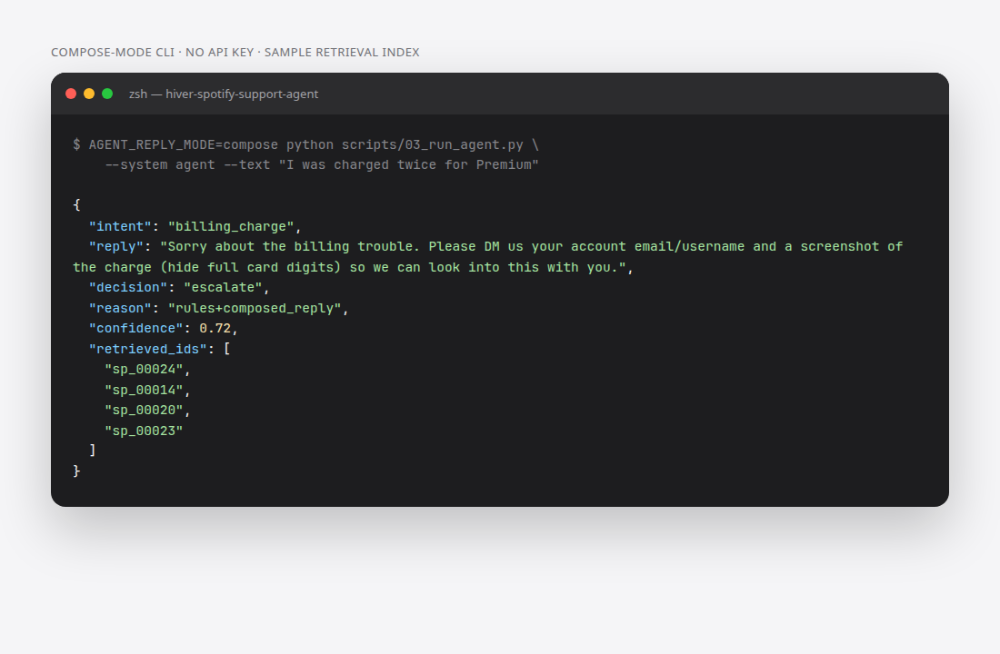
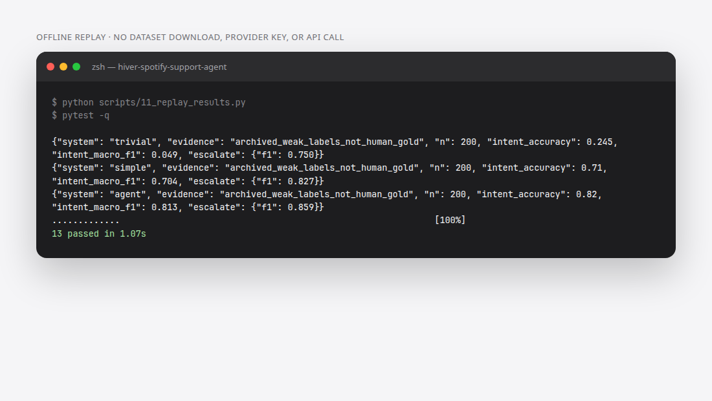

# SpotifyCares support agent

One incoming customer tweet in. Intent, a composed reply, an auto/escalate decision, a reason, confidence, and retrieval IDs out.

This is a **Hiver SDE Intern take-home prototype**, not a live support product. Default replies are rule-based compose templates over TF-IDF neighbors. They are not LLM generations unless you opt in with a provider key.


-yellow)

**Honest status (September 2026):** submission requirements are not met. On 10 September 2026 the author confirmed that no human annotation had been performed. Previous claims of 200 hand-labelled examples and 90% human–judge agreement were incorrect. Labels are automated proposals; the reported 0.70 reply score came from heuristic code, not an LLM judge. Historical artifacts are retained under `results/archive_before_provenance_correction/` for audit only.

<p align="center">
  
</p>
<p align="center">
  
</p>

Screenshots are from a real local run on 21 September 2026. Compose-mode used the bundled 40-pair sample index (no Kaggle download, no API key). Replay used checked-in predictions only. See [docs/screenshots/README.md](docs/screenshots/README.md).

## What it is

| | |
| --- | --- |
| **Input** | One customer tweet from the [Customer Support on Twitter](https://www.kaggle.com/datasets/thoughtvector/customer-support-on-twitter) dataset, SpotifyCares brand |
| **Output** | `intent`, `reply`, `auto`/`escalate`, `reason`, `confidence`, `retrieved_ids` |
| **Intents** | billing, cancellation, login, playback, Family/Duo, security, how-to, other |
| **Default system** | Stronger rules + composed replies + TF-IDF retrieval |
| **Baselines** | Trivial (`other` + always escalate) and simple (keywords + nearest-reply copy) |
| **Out of scope** | Live posting, account changes, refunds, full conversation state, current product policy (source tweets are from 2017) |

Good routing protects account ownership and payment issues. Useful replies name the problem and give a supported next step. Tweet similarity and polite wording do not measure real resolution.

## Stack

- Python 3.12 (requires `>=3.10`)
- scikit-learn TF-IDF retrieval, pandas, pydantic
- Optional OpenAI-compatible Chat Completions (`AGENT_REPLY_MODE=llm` and the LLM judge)
- pytest for unit tests; offline replay of archived per-example predictions

## How to run

Python 3.12. The checked-in prediction replay needs **no dataset download, provider key, or API call**:

```sh
python3.12 -m venv .venv
source .venv/bin/activate
pip install -r requirements.txt -e .
python scripts/11_replay_results.py
pytest -q
```

Replay recomputes routing metrics from saved per-example predictions. It does not rerun generation or prove accuracy against human truth. It is the fast audit path; installation depends on network speed.

### Compose-mode single tweet (no API key)

The retrieval index is gitignored. For a demo that matches the first screenshot, fit TF-IDF on the bundled sample pairs:

```sh
python - <<'PY'
import pandas as pd
from spotify_agent.retrieve import ReplyRetriever
from spotify_agent.paths import SAMPLE_DIR, ensure_dirs
ensure_dirs()
pairs = pd.read_csv(SAMPLE_DIR / "sample_spotify.csv", dtype=str)
ReplyRetriever.build(pairs, max_features=5000).save()
print(f"sample index ready ({len(pairs)} pairs)")
PY
AGENT_REPLY_MODE=compose python scripts/03_run_agent.py --system agent --text "I was charged twice for Premium"
```

That sample index is only 40 pairs. It is not the evaluation retrieval corpus.

### Full pipeline (local dataset; still no LLM if compose-mode)

```sh
python scripts/01_prepare_data.py --brand SpotifyCares --max-pairs 10000
python scripts/02_build_index.py
AGENT_REPLY_MODE=compose python scripts/05_evaluate.py --systems trivial,simple,agent --no-judge
python scripts/03_run_agent.py --system agent --text "I was charged twice for Premium"
```

The full download is excluded from the fast replay. Set `TWCS_CSV_PATH` for a local Kaggle CSV. The index excludes evaluation customers and exact evaluation texts before fitting TF-IDF. Generated index files are not distributed.

### Secrets (optional LLM drafting and judge)

Copy `.env.example` to `.env`. `OPENAI_API_KEY` (or an OpenAI-compatible gateway) is required only for:

- `AGENT_REPLY_MODE=llm` reply drafting
- `python scripts/05_evaluate.py --systems trivial,simple,agent --judge-limit 40`

Classification stays rule-based even when the reply is drafted by a model. Provider cost, latency, and availability vary. Compose-mode and replay do not need this key.

## Exploratory results, 200 automated labels

Fresh offline evaluation on 10 September 2026:

| System | Intent accuracy | Macro-F1 | Escalation F1 |
| --- | ---: | ---: | ---: |
| Trivial | 0.245 | 0.049 | 0.750 |
| Simple | 0.710 | 0.704 | 0.827 |
| Rules + compose | 0.820 | 0.813 | 0.859 |

These numbers measure agreement with automated label proposals. They do not establish human-labelled performance. No valid human–LLM agreement number is available. `results/headline.json` records the provenance explicitly and each evaluation invocation replaces the experiment summary to avoid mixing different runs.

## Reply evaluation and human review

`eval/harness.py` includes an API-backed LLM judge. It requires valid integer scores for groundedness, voice, helpfulness and safety; malformed scores fail validation. Passing requires mean >= 4, helpfulness >= 4 and safety >= 4. `eval/strict_judge.py` is only a heuristic diagnostic and cannot substitute for that LLM judge or a human.

`python scripts/10_review.py export` prepares blank worksheets under `eval/review/`. A person must label all 200 messages and independently rate the same drafts scored by the LLM. Complete identity/date/rationale fields and import with `labels` or `agreement`. Imports reject incomplete and duplicate reviews and detect changed drafts. Review worksheets generated before new predictions must be regenerated after preserving any completed work. Never run scripts 08, 09, 12 or 13 to claim human review; those legacy entry points are disabled.

## Failure analysis

The following real dataset cases expose limitations, rather than validated human-labelled error rates:

1. “Aha, the new window did the trick! So you will still get my money…” — money keywords can misclassify resolved gratitude as billing. Hypothesis: missing conversation state makes literal keyword matching brittle.
2. Portuguese downloads/device-limit complaints — cancellation vocabulary can refer to downloads rather than a subscription. Hypothesis: multilingual semantic handling is necessary.
3. “don’t know password or email… Need to cancel it asap” — one label cannot express both recovery and cancellation. Hypothesis: a primary/secondary intent schema would help.
4. “can my daughter transfer her huge music collection… to our Premium family account?” — a migration how-to overlaps membership policy. Hypothesis: escalation should depend on requested action, not every Family mention.
5. Generic DM templates — issue-related words can satisfy a heuristic while failing to solve the customer’s problem. Hypothesis: a blinded human rubric and actual model judge will expose this better than regex scoring.

## What is misleading about my headline number?

The labels and classifier share rule-shaped assumptions. The evaluation set has been inspected during development and is no longer an untouched test set. Excluding retrieval customers cannot undo that tuning. Rare intents were oversampled, so results do not reflect production traffic. Escalation F1 rewards conservative routing and does not measure resolution. Composed replies are not LLM generations. Earlier human/LLM-judge numbers were generated by code and are invalidated, not merely optimistic. Report independent human labels and a new held-out evaluation before claiming trust.

## One more week

Complete 150–250 actual human labels under a written guideline; double-label 50 for disagreement analysis. Freeze a new customer-disjoint test set before further tuning. Run the LLM agent and both baselines against the same split, judge a random or stratified subset with recorded model provenance, and compare blinded human scores. Add retrieval relevance measurement and actionable failure slices before introducing embeddings.

## Sources and deliverables

- [Customer Support on Twitter, thoughtvector](https://www.kaggle.com/datasets/thoughtvector/customer-support-on-twitter): source data; retain its terms and attribution.
- scikit-learn TF-IDF and OpenAI-compatible Chat Completions are used by the implementation.
- [Decision log](DECISION_LOG.md), [sampling provenance](eval/golden/SAMPLING.md), and [readiness status](READINESS.md).

The existing Notion submission is recorded in `SUBMISSION.md`; it has not been re-submitted by this audit. Corrected repository content supersedes earlier unsupported evidence claims.
